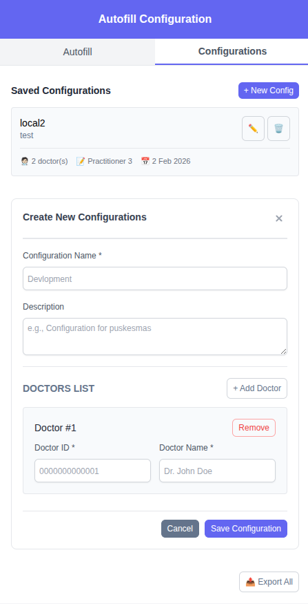

# Vue Chrome Extension Boilerplate


Chrome Extension dibuat dengan **Vue 3** dan **Tailwind CSS 3**.

## 📋 Prerequisites

- Node.js (v16 atau lebih tinggi)
- npm atau yarn

## 🚀 Instalasi

1. Install dependencies:
```bash
npm install
```

## 🛠️ Development

```bash
npm run dev
```

## 📦 Build untuk Production

```bash
npm run build
```

Hasil build akan ada di folder `dist/`.

## 🔧 Install Extension ke Chrome

1. Build project terlebih dahulu dengan `npm run build`
2. Buka Chrome dan ketik `chrome://extensions/` di address bar
3. Aktifkan **Developer mode** (toggle di kanan atas)
4. Klik **Load unpacked**
5. Pilih folder `dist/` dari project ini
6. Extension akan muncul di toolbar Chrome

## 📁 Struktur Project

```
vue-chrome-extension/
├── public/
│   └── manifest.json          # Chrome extension manifest
├── src/
│   ├── App.vue               # Main component
│   ├── main.js               # Entry point
│   └── style.css             # Tailwind CSS imports
├── index.html                # Popup HTML
├── package.json
├── vite.config.js
├── tailwind.config.js
└── postcss.config.js
```

## ✨ Fitur

- ✅ Vue 3 Composition API
- ✅ Tailwind CSS 3
- ✅ Vite untuk fast development
- ✅ Button dengan console.log functionality
- ✅ Responsive design

## 🎨 Customize

Edit `src/App.vue` untuk mengubah tampilan dan functionality extension Anda.

## 📝 Notes

- Extension ini menggunakan Manifest V3 (versi terbaru)
- Anda bisa menambahkan icon di folder `public/icons/` (ukuran 16x16, 48x48, 128x128)
- Untuk menambahkan permissions, edit `public/manifest.json`
